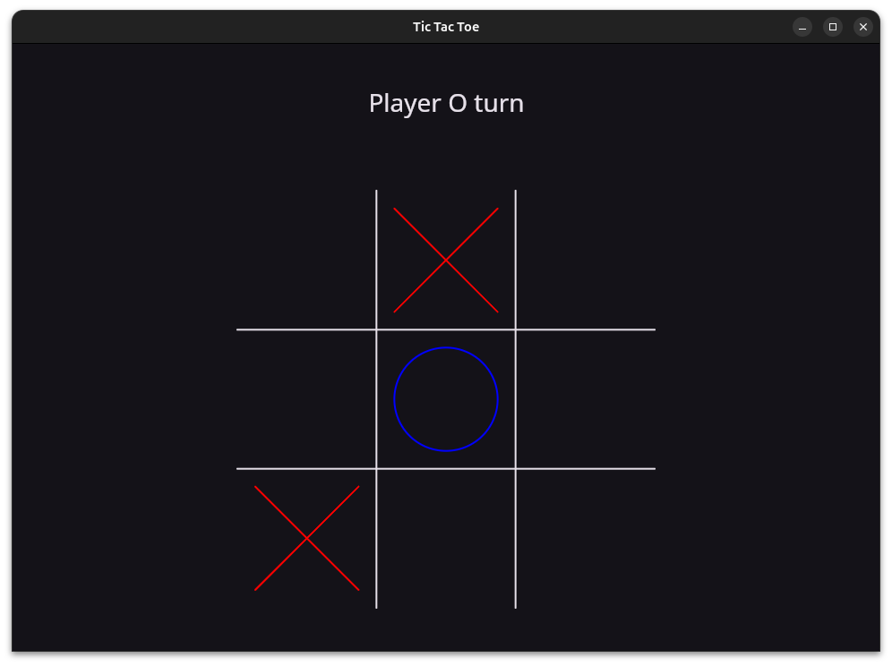
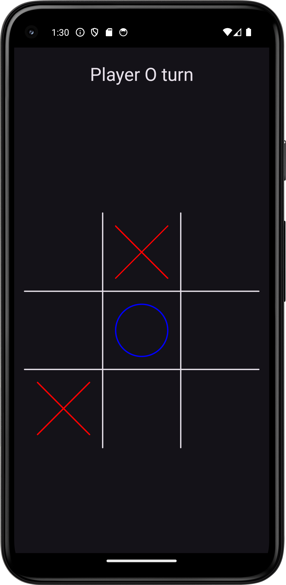

# Tic Tac Toe Game - Kotlin Multiplatform Client

## Overview

This is a simple multiplayer Tic Tac Toe game built with Kotlin Multiplatform (KMP), supporting both Android and Desktop platforms using Compose Multiplatform (CMP).

## Features

* Create and join rooms.
* Real-time gameplay.
* Handle reconnections and network changes.
* Same codebase for Android and Desktop.
* Clean architecture with shared logic between platforms.

## Demo

 
   

